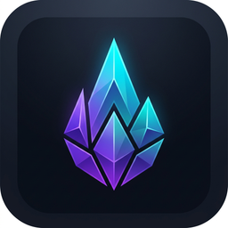

<p align="center">
  
</p>

<h1 align="center">PYRA</h1>

<p align="center">
  <strong>A modern, high-polish Windows desktop game launcher.</strong>
  <br />
  Built with Electron · React · TypeScript · Vite
</p>

<p align="center">
  
  
  
  
  
</p>

---

## 🎮 What is Pyra?

**Pyra** is a sleek, dark-themed desktop game launcher for Windows inspired by the visual quality of modern PC gaming platforms. It provides a complete experience for browsing, installing, updating, launching, and managing games — all from a polished, image-focused interface.

### Key Features

- 🏠 **Home** - Cinematic hero spotlight with featured games and recently played titles.
- 🛒 **Store** - Browse the full game catalog with search, genre filters, and sorting.
- 🎮 **Game Details** - Cinematic game pages with screenshots, metadata, and action controls.
- 📚 **Library** - View and launch all installed games at a glance.
- ⬇️ **Downloads** - Real-time download manager with progress, speed (MB/s), ETA, pause, resume, and cancel.
- ⚙️ **Settings** - Configure install location, bandwidth limits, launch behavior, and storage analytics.
- 🔄 **Updates** - Automatic version detection with one-click game updates.
- 🗑️ **Uninstall** - Safe removal of game files with confirmation dialogs.
- 🌐 **Offline Mode** - Launch installed games and browse cached catalog data without internet.
- 🔒 **Security** - Electron contextIsolation, secure IPC bridge, Zip Slip prevention, HTTPS-only downloads, and URL validation.

---

## 🏗️ Architecture

```
Pyra Desktop Launcher (Electron)
    ↓  HTTPS
Hosted Catalog API (Vercel Serverless)
    ↓  JSON metadata + CDN URLs
CDN / Object Storage (Archive.org / R2 / S3)
    ↓  Direct ZIP download
Local Installation (%LOCALAPPDATA%\Pyra\games\)
```

Pyra **never** runs a server on your PC. The catalog API is hosted on Vercel and game archives are served directly from CDN storage.

---

## 📂 Project Structure

```
src/
├── main/                  # Electron main process
│   ├── index.ts           # App entry, IPC handlers, window creation
│   ├── storage.ts         # Local JSON storage abstraction
│   ├── catalogManager.ts  # HTTPS catalog fetcher with validation & caching
│   ├── downloadManager.ts # HTTP download engine (pause/resume/cancel/speed/ETA)
│   ├── installManager.ts  # ZIP extraction with Zip Slip security
│   ├── gameManager.ts     # Uninstall & folder management
│   └── processManager.ts  # Game process spawning & tracking
├── preload/
│   └── index.ts           # Secure contextBridge (window.pyraAPI)
├── renderer/              # React UI
│   ├── App.tsx
│   ├── context/           # Global state (LauncherContext)
│   ├── components/        # TitleBar, Sidebar, GameCard, Modals, Toasts
│   ├── pages/             # Home, Store, Library, Downloads, Settings, GameDetail
│   └── styles/            # CSS design system
├── shared/
│   └── types.ts           # Shared TypeScript interfaces
backend/
├── api/
│   ├── catalog.json       # Game catalog (Git-managed)
│   └── catalog.ts         # Vercel serverless API route
├── vercel.json            # Vercel deployment config
└── README.md              # Backend deployment guide
```

---

## 🚀 Getting Started (Development)

### Prerequisites

- [Node.js](https://nodejs.org/) v18+
- npm v9+

### Install & Run

```bash
# Install dependencies
npm install

# Build everything (renderer + main process)
npm run build

# Launch the Electron app
npm start
```

### Build Windows Installer

```bash
npm run dist
```

The installer will be generated at `dist-electron/Pyra Setup X.X.X.exe`.

---

## 🤝 Contributing

Community contributions are **deeply appreciated and warmly welcomed**!

You can:
- 🐛 **Report bugs** via GitHub Issues.
- 💡 **Suggest new features or games** via GitHub Discussions or Issues.
- 🔧 **Submit Pull Requests** to fix bugs, polish UI, or add new launcher capabilities.
- 🎮 **Propose Catalog Additions** by submitting PRs for `backend/api/catalog.json`.

---

## 📜 License & Community Boundaries

Pyra is released under a **Source-Available Community License**. See [LICENSE](LICENSE) for full details.

### 🌟 What is Welcomed & Encouraged:
- ✅ **Personal Use** — Use the official Pyra launcher for gaming.
- ✅ **Open Codebase** — Read, inspect, and learn from the code.
- ✅ **Pull Requests & Development** — Fork to work on PRs and contribute improvements back to Pyra.
- ✅ **Catalog Suggestions** — Propose games to be added to the official catalog.

### 🛡️ Boundaries for User Safety & Project Integrity:
- 🔒 **Official Distribution** — Binaries & packages are provided exclusively through official Pyra releases to prevent malware or fake builds.
- 🔒 **Official Backend** — The `backend/` infrastructure and official game catalog are managed by the project author (`fmdxp`) to guarantee download safety and source verification.
- 🔒 **No Commercial Clones** — Pyra code/branding cannot be used to sell or rebrand alternative launchers.

---

<p align="center">
  <strong>PYRA</strong> — Play your way.
  <br />
  <sub>© 2026 fmdxp. All rights reserved.</sub>
</p>
